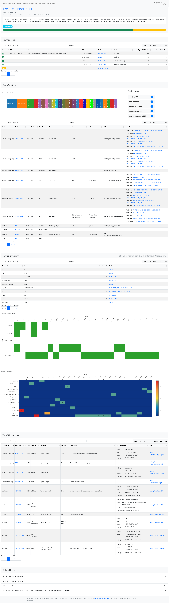

# NmapView


**NmapView** transforms raw Nmap XML scan results into rich, interactive HTML reports - making large-scale network scans easier to explore, understand, and share. By leveraging **Bootstrap** and **DataTables**, the reports are intuitive and responsive, with built-in filtering, sorting, and export options.

> ⚠️ **Notice**: This software must **not** be used by military or secret service organisations.

---

## ✨ Key Features

* **Interactive Tables**
  Fully searchable and sortable tables using Bootstrap and DataTables for all core sections.

* **Multi-format Exporting**
  Export data directly from the browser to **JSON**, **CSV**, **Excel**, or **PDF**.

* **Intelligent Service Classification**
  Aggregates services for better clarity.

* **Web & SSL Analysis**
  Extracts HTTP titles, follows redirects, displays SSL certificate metadata, and shows HTTPS misconfigurations.

* **Host Overview**
  Displays per-host details such as open ports, detected OS, MAC addresses, and more.

* **Encryption Indicators**
  Flags whether services are encrypted (SSL/TLS, STARTTLS) or plaintext, aiding compliance checks.

* **Vulnerability Integration**
  Automatically links detected services to public vulnerabilities via `vulners` and Nmap scripts (e.g., CVEs, MSF, PacketStorm).

* **Communication Matrix + Heatmaps**
  Visual summaries show port-to-host mappings and service usage patterns across the network.

* **Service Inventory View**
  Quickly understand which services run where - grouped by type, port, and protocol.

---

## 📸 Example Report

Want to see what it looks like?
👉 [**Check out the live sample report**](https://möbius.band/report.html)

[](https://möbius.band/report.html)

---

## 🧭 Report Structure Overview

### 1. **Scanned Hosts**

A concise overview of all scanned devices:

* Host status (`up`/`down`)
* MAC address and vendor (if detected)
* Operating system fingerprinting
* IP address and hostname
* Number of open **TCP** and **UDP** ports

Ideal for identifying which hosts are online and gathering basic inventory data.

---

### 2. **Open Services**

All open services from the scan are presented in a flat, sortable table:

* Hostname & IP  
* Port & protocol  
* Service name & version  
* CPE & detected product info  
* Exploit references with CVSS scores (e.g., CVE, MSF modules)

A **Service Distribution Diagram** is also included, visualizing the frequency of all detected services to help spot overexposed protocols or unexpected patterns.


---

### 3. **Service Inventory**

Group services by type:

* Aggregates all detected service names
* Lists associated ports and hosts
* Counts instances for service prevalence tracking

Useful for architecture reviews, compliance checks, and inventory audits.

* **Communication Matrix**: Hosts on the Y-axis, ports on the X-axis - see service mappings at a glance.
* **Service Heatmap**: Visual representation of how frequently each service/port appears across your hosts.
---

### 4. **Web/SSL Services**

Focuses on web-based services:

* Displays full HTTP/HTTPS banner info, titles, and redirects
* SSL certificate metadata: subject, issuer, expiry, algorithm
* Direct clickable URLs to live services (useful for recon/audits)
* Highlights services that fail SSL best practices (e.g., expired or self-signed certs)

---

### 5. **Online Hosts (Deep-Dive)**

Accordion-style breakdown for each reachable device:

* Per-host open ports
* All detected service banners
* All Script outputs
* Associated CVEs and potential exploits

Perfect for incident response and deeper analysis.

---

## ⚙️ Usage Instructions

1. Download the XSLT stylesheet:

   ```bash
   wget https://raw.githubusercontent.com/dreizehnutters/NmapView/main/nmap2html.xsl
   ```

2. Generate an HTML report from your XML scan file:

   ```bash
   xsltproc -o report.html nmap2html.xsl your_scan.xml
   ```

> Make sure your Nmap scan includes the `-oX` or `-oA` output format and sufficient script data:

```bash
nmap -sV -O --script="default or vulners or http-headers or ssl-cert or banner" -oA scan_output -iL targets.txt
```

---

## 🙌 Acknowledgments

* Powered by the excellent [Nmap](https://nmap.org) network scanning tool
* Based on the outstanding work of [honze-net](https://github.com/honze-net) and [Haxxnet](https://github.com/Haxxnet/nmap-bootstrap-xsl)
* Forked and enhanced from [Haxxnet/nmap-bootstrap-xsl](https://github.com/Haxxnet/nmap-bootstrap-xsl)

---

## 🐛 Feedback & Contributions

If you find bugs, have ideas for features, or want to contribute, feel free to:

* [Open an issue](https://github.com/dreizehnutters/NmapView/issues)
* Submit a pull request with improvements
* Star the repo if you found it helpful ⭐

Your feedback drives future improvements. Thank you!

