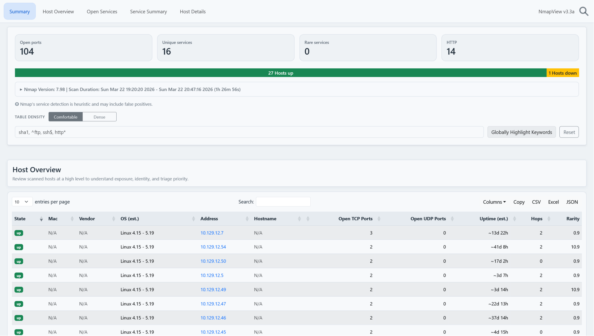

# NmapView

[](https://github.com/dreizehnutters/NmapView/releases/latest/download/NmapView.xsl)
[](https://github.com/dreizehnutters/NmapView/actions/workflows/report-html-regression.yml)
[](https://möbius.band/report.html)
[](https://github.com/dreizehnutters/NmapView/releases/latest/download/NmapView.xsl)

**Stop staring at raw XML. Get instant, interactive insights.**

NmapView transforms flat Nmap XML into a **single, portable, interactive HTML dashboard** for analysis and triage.


> No backend, no database, and no reporting pipeline required. Open it locally amd review hosts, open services, service variants, and visualizations in one file. Share it, export from it, or archive it.


<p align="center">
  <a href="https://möbius.band/report.html">
    
  </a>
</p>

<p align="center">
  <a target="_blank" href="https://möbius.band/report.html">&gt; Open Demo Report &lt;</a>
</p>

<p align="center">
  <a target="_blank" href="https://möbius.band/blog/nmapview/">&gt; Blog Post &lt;</a>
</p>

## Quick Start

Render any existing Nmap XML file in seconds using `xsltproc` (pre-installed on most Linux/macOS systems):

```bash
# 1. Download the latest stylesheet
curl -fsSL -o NmapView.xsl https://github.com/dreizehnutters/NmapView/releases/latest/download/NmapView.xsl

# 2. Transform your scan
xsltproc -o report.html NmapView.xsl scan.xml
```

Open the generated HTML file in your browser.

## Why Try It

- Turn raw XML into a report you can read and share without extra tooling
- Review hosts, open services, service variants, and host details in one place
- Search, sort, highlight, and export data to find "low-hanging fruit"
- Visualize technical scan data into insightful plots
- Keep the result as one portable HTML file

## Core Features

- Single-file interactive HTML output
- Searchable, sortable tables
- Export to CSV, Excel, and JSON
- Global keyword highlighting
- Portable output you can share or archive

## Report Sections

- **Host Overview**: Triage hosts by IP, hostname, vendor, OS guess, open TCP/UDP port counts or service rarity.
- **Host Scope**: Keep or exclude visible hosts and recalculate downstream tables, exports, and plots against only that selected subset.
- **Open Services**: Review exposed services across hosts with versions, extra info, clickable CPEs, and Vulners-linked context.
- **Service Summary**: Group service and NSE output by service, port, product, and version so repeated software, web stacks, and unusual variants stand out across hosts.
- **Host Details**: Drill into each host scanned ports and corresponding complete script output

## Visualizations

- **Open Ports Per Host**: Compare exposure across systems at a glance.
- **Operating System Distribution**: See which OS families dominate the environment and where platform diversity or concentration stands out.
- **Service Distribution Across Hosts**: See which services are most widespread and which appear on only a few hosts.
- **Host-Service Relationships**: See which services are shared across hosts and which are isolated.
- **Host-Port Matrix**: See which ports appear on which hosts and spot unusual exposure patterns.
- **Service-Port Heatmap**: Confirm expected port usage and spot unusual service-to-port combinations.


## Requirements

- `xsltproc` to transform XML into HTML

No Python, Node, or backend required.

## Typical Use Cases

- Internal network assessments
- External attack surface reviews
- Pentest evidence packaging
- Asset and service inventory review
- Comparing repeated service exposure across hosts
- Sharing scan results with engineers, clients, or internal stakeholders
- Reviewing large scans without working through raw XML

## For Contributors

PRs are welcome.

- `xsl/`: split XSL source
- `tools/`: build helper, checks, and local XML fixtures

Build the standalone stylesheet with:

```bash
python3 tools/build_xsl.py
```

## Feedback

If the project is useful and saved you an hour of manual grepping today, star it. Open an issue for bugs, UX friction, or feature requests.

## Acknowledgment & Credits

Special thanks to the foundations laid by:

- [honze-net](https://github.com/honze-net) for [nmap-bootstrap-xsl](https://github.com/honze-net/nmap-bootstrap-xsl)
- [Haxxnet](https://github.com/Haxxnet) for [nmap-bootstrap-xsl](https://github.com/Haxxnet/nmap-bootstrap-xsl)
